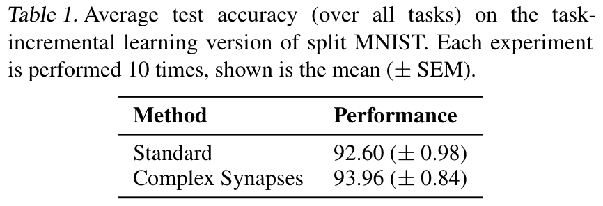

# Complex Synapses for Deep Learning
This is a deep learning implementation of the complex synapse model proposed in 
[Benna & Fusi (2016; Nat Neuro)](https://www.nature.com/articles/nn.4401).
The complex synapse model is implemented as a [PyTorch optimizer object](https://pytorch.org/docs/stable/optim.html),
and it can be used to train any neural network.
To use these complex synapses in your own deep learning experiment,
simply replace your current optimizer (e.g., SGD or Adam) with the 
[complex synapse optimizer](https://github.com/GMvandeVen/complex-synapses/blob/main/complex_synapses.py).

The complex synapse algorithm regularizes the synaptic strenght (i.e., the parameters of the network)
at multiple timescales, such that stored memories (in parameter space) decay approximately according to a power law.


## Requirements
The current version of the code has been tested with:
* `pytorch 1.1.0`
* `torchvision 0.2.2`


## The complex synapse optimizer object
All code for the complex synapse optimizer is contained in `complex_synapses.py`.
There are two versions: one in combination with the standard SGD optimizer
(see [here](https://github.com/GMvandeVen/complex-synapses/blob/83cc3f18e8cda92cfed8669870c563aca2a14099/complex_synapses.py#L19))
and one in combination with the Adam optimzer
(see [here](https://github.com/GMvandeVen/complex-synapses/blob/83cc3f18e8cda92cfed8669870c563aca2a14099/complex_synapses.py#L127)).


#### Parameters
The three main parameters for the complex synapse model that need to be set are:
* `n_beakers`:  the number of beakers
* `alpha`:      the shortest synaptic timescale
* `beta`:       the longest synaptic timescale

Both `alpha` and `beta` are expressed in number of iterations.
The longest synaptic timescale should be set such that it covers the maximum amount of time a memory should be stored
(e.g., for a fixed-duration continual learning experiment, `beta` could be set equal to the total number of iterations).
The shortest synaptic timescale should be set such that it corresponds to the rate at which new memories arrive
(e.g., for a task-based continual learning experiment, `alpha` could be set equal to the number of iterations per task;
although it could be argued that there are multiple memories per task and that `alpha` should be set smaller).
The number of beakers determines how closely the decay of the parametric memory approximates a power law
(i.e., the higher `n_beakers`, the more precisely the complex synapse algorithm does what it is intended to do),
but the computational cost also increase with `n_beakers`. The optimal value for `n_beakers` likely depends on the
timescale for which we want a power law decay (i.e. the difference between `beta` and `alpha`).


## Example experiments
To test the deep learning version of the complex synapse algorithm on a simple continual learning problem,
the script `main_example.py` can be used.
This script trains and tests a simple deep neural network on an MNIST-based continual learning experiment.

The main options of this script are:
* `--experiment`: which task protocol? (`splitMNIST`|`permMNIST`)
* `--scenario`: according to which scenario? (`task`|`domain`|`class`)
* `--stream`: what kind of data stream? (`task-based`|`random`)
* `--tasks`: how many tasks?

See [van de Ven & Tolias (2019; arXiv)](https://arxiv.org/abs/1904.07734)
for a description of the different continual learning scenarios.

To use the complex synapse algorithm, select the flag `--cs`.
Other input arguments can be used to set the number of beakers (`--beakers`), the shortest synaptic timescale (`--alpha`) and
the longest synaptic timescale (`--beta`).

For information on further options: `./main_example.py -h`.


#### On-the-fly plots during training
It is possible to track progress during training with on-the-fly plots, by adding the flag `--visdom`.
This feature requires `visdom`
(see [here](https://github.com/facebookresearch/visdom) for more information), 
which can be installed using:
```bash
pip install visdom
```
Before running the experiments, the visdom server should be started from the command line:
```bash
python -m visdom.server
```
The visdom server is now alive and can be accessed at `http://localhost:8097` in your browser (the plots will appear
there).


## Comparison on Split MNIST
The script `compare.py` can be used to compare the performance of a simple deep neural network trained on 
Split MNIST with and without using the complex synapse algorithm.
On the task-incremental learning scenario,
using the complex synapse algorithm gives a small increase in performance:



These results were obtained with the following command:
```bash
./compare.py --scenario=task --iters=500 --alpha=500 --beta=2500 --beakers=5 --n-seeds=10
```


### Acknowledgements
This code has been developed as part of a research project supported by the Lifelong Learning Machines (L2M) program 
of the Defence Advanced Research Projects Agency (DARPA) via contract number HR0011-18-2-0025.
